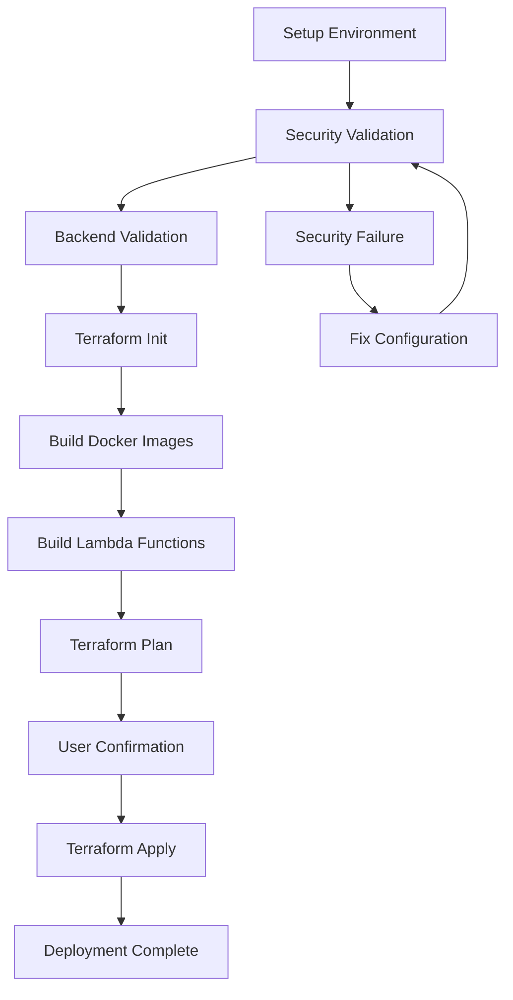

# Treza Terraform Deployment Guide

## 🚀 Quick Start

### Prerequisites
- AWS CLI configured with appropriate credentials
- Terraform >= 1.0
- Docker installed and running
- Bash shell

### 1. Environment Setup
```bash
# Choose your environment: dev, staging, or prod
./scripts/setup-environment.sh dev
```

### 2. Security Configuration
**CRITICAL**: Before deploying, update the security settings in your environment's `.tfvars` file:

```bash
# Edit the environment configuration
nano terraform/environments/dev.tfvars
```

**Required Updates:**
- Replace `172.16.0.0/16` with your actual corporate network CIDR
- Add your office public IP to `allowed_ssh_cidrs`
- Customize `management_cidrs` to match your VPC subnets

### 3. Deploy
```bash
./scripts/deploy.sh dev
```

## 🔒 Security Configuration

### SSH Access Control
Each environment has different SSH access policies:

| Environment | SSH Port | Allowed Networks | Security Level |
|-------------|----------|------------------|----------------|
| **Dev**     | 22       | VPC + Corporate  | Permissive     |
| **Staging** | 22       | VPC + Corporate  | Moderate       |
| **Prod**    | 2222     | VPC Only         | Restrictive    |

### Network Topology
```
Dev Environment (10.0.0.0/16)
├── Management Subnets: 10.0.10.0/24, 10.0.11.0/24
└── SSH Access: VPC + Corporate Network

Staging Environment (10.1.0.0/16)  
├── Management Subnets: 10.1.10.0/24, 10.1.11.0/24
└── SSH Access: VPC + Corporate Network

Production Environment (10.2.0.0/16)
├── Management Subnets: 10.2.10.0/24, 10.2.11.0/24
└── SSH Access: VPC Only (Most Secure)
```

## 📋 Environment-Specific Configuration

### Development Environment
```bash
# File: terraform/environments/dev.tfvars
allowed_ssh_cidrs = [
  "10.0.0.0/16",      # VPC CIDR
  "172.16.0.0/16",    # Corporate network (REPLACE)
  # "YOUR_OFFICE_IP/32"  # Add your office IP
]

security_group_rules = {
  ssh_port         = 22
  enclave_port     = 8080
  monitoring_port  = 9090
  allowed_protocols = ["tcp", "udp", "icmp"]  # Permissive for dev
}
```

### Staging Environment
```bash
# File: terraform/environments/staging.tfvars
allowed_ssh_cidrs = [
  "10.1.0.0/16",      # Staging VPC CIDR
  "172.16.0.0/16",    # Corporate network (REPLACE)
]

security_group_rules = {
  ssh_port         = 22
  enclave_port     = 8443    # HTTPS port
  monitoring_port  = 9443    # Secure monitoring
  allowed_protocols = ["tcp"]  # More restrictive
}
```

### Production Environment
```bash
# File: terraform/environments/prod.tfvars
allowed_ssh_cidrs = [
  "10.2.0.0/16",      # Production VPC CIDR only
  # "172.16.100.0/24"   # Specific admin network only
]

security_group_rules = {
  ssh_port         = 2222     # Non-standard SSH port
  enclave_port     = 8443     # HTTPS port
  monitoring_port  = 9443     # Secure monitoring
  allowed_protocols = ["tcp"] # Most restrictive
}
```

## 🛡️ Security Validations

The deployment scripts now include automatic security validations:

### ✅ Checks Performed
- ❌ Blocks SSH access from `0.0.0.0/0`
- ❌ Prevents placeholder values like `YOUR_OFFICE_IP`
- ✅ Validates required security variables exist
- ✅ Ensures environment-specific configurations

### 🚨 Common Security Issues
1. **SSH from 0.0.0.0/0**: Never allow SSH from anywhere on the internet
2. **Placeholder IPs**: Replace all `YOUR_OFFICE_IP` with actual values
3. **Missing Variables**: Ensure all security variables are defined

## 🔧 Troubleshooting

### Security Validation Failures
```bash
❌ ERROR: SSH access from 0.0.0.0/0 detected
```
**Solution**: Update `allowed_ssh_cidrs` with specific CIDR blocks

```bash
❌ ERROR: Placeholder 'YOUR_OFFICE_IP' found
```
**Solution**: Replace with your actual office IP address

### Backend Issues
```bash
❌ Backend validation failed!
```
**Solution**: Create backend resources:
```bash
./scripts/create-backend.sh dev
```

### Missing Security Variables
```bash
❌ ERROR: allowed_ssh_cidrs not found
```
**Solution**: Add security configuration to your `.tfvars` file

## 📚 Best Practices

### 1. Network Security
- Use specific CIDR blocks, never `0.0.0.0/0` for SSH
- Separate VPC CIDRs per environment to avoid conflicts
- Use non-standard SSH ports in production (2222)

### 2. Environment Isolation
- Different AWS regions per environment (recommended)
- Separate AWS accounts for production (highly recommended)
- Environment-specific backend state buckets

### 3. Access Control
- Limit SSH access to management subnets
- Use bastion hosts for production access
- Implement MFA for production deployments

### 4. Monitoring
- Different log retention periods per environment
- Enhanced monitoring in production
- Security group rule auditing

## 🚀 Deployment Workflow



## 📞 Support

If you encounter issues:
1. Check the security validation output
2. Verify your network CIDR blocks are correct
3. Ensure backend resources exist
4. Review the deployment logs for specific errors

For additional help, refer to the main [README.md](README.md) file.
