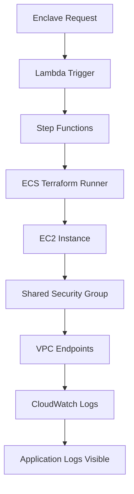
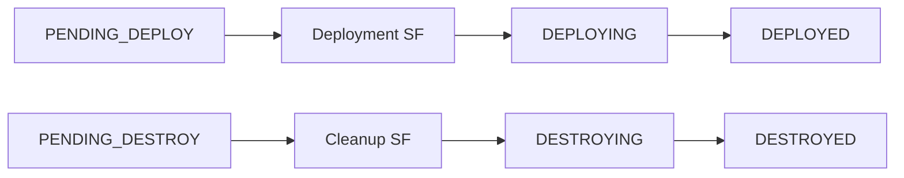

# Treza Terraform Infrastructure

A comprehensive Terraform infrastructure for deploying AWS Nitro Enclaves using an event-driven architecture with DynamoDB Streams, Step Functions, and ECS. **Now featuring fully automated shared security group management and optimized user data handling.**

## 🏗️ Architecture Overview

```
DynamoDB Stream → Lambda Trigger → Step Functions → ECS Terraform Runner → AWS Nitro Enclaves
                                      ↓
                              Update DynamoDB Status
```

### Key Components

- **DynamoDB Streams**: Event-driven triggers for enclave lifecycle management
- **Step Functions**: Orchestrate long-running deployment and cleanup workflows  
- **ECS Fargate**: Run Terraform in a secure, containerized environment
- **Lambda Functions**: Handle validation, error processing, and workflow coordination
- **Terraform Modules**: Reusable, production-ready infrastructure components
- **🆕 Shared Security Groups**: Automated VPC endpoint access for all enclaves
- **🆕 Optimized User Data**: Efficient bootstrap scripts under AWS size limits

## 📋 Prerequisites

- AWS CLI configured with appropriate permissions
- Terraform >= 1.6.0
- Docker (for building the Terraform runner container)
- An existing DynamoDB table from treza-app for enclave management
- Make (for convenient commands)

### 🛠️ Developer Setup (Optional but Recommended)
```bash
# Install development tools
pip install pre-commit
brew install tflint tfsec checkov shellcheck terraform-docs  # macOS
# or
apt-get install shellcheck  # Ubuntu

# Setup development environment
make setup-dev
```

## 🚀 Quick Start

### 1. Clone and Configure

```bash
git clone <your-repo-url>
cd treza-terraform

# Copy and customize variables
cp terraform/terraform.tfvars.example terraform/terraform.tfvars
```

### 2. Configure Backend

Create a backend configuration file:

```bash
# terraform/backend.conf
bucket         = "your-terraform-state-bucket"
key            = "treza/terraform.tfstate"
region         = "us-west-2"
dynamodb_table = "terraform-locks"
```

### 3. Deploy Infrastructure

```bash
cd terraform

# Initialize with backend configuration
terraform init -backend-config=backend.conf

# Review the deployment plan
terraform plan

# Deploy the infrastructure
terraform apply
```

### 4. Build and Deploy Docker Container

```bash
# Build with correct architecture for ECS Fargate
docker build --platform linux/amd64 -f docker/terraform-runner/Dockerfile -t treza-dev-terraform-runner:latest .

# Tag and push to ECR
docker tag treza-dev-terraform-runner:latest YOUR_ECR_REPO:latest
docker push YOUR_ECR_REPO:latest
```

## 📁 Repository Structure

```
treza-terraform/
├── terraform/              # Main Terraform configuration
├── modules/                 # Reusable Terraform modules
│   ├── networking/         # 🆕 Enhanced VPC with shared security groups
│   ├── iam/               # IAM roles and policies
│   ├── dynamodb/          # DynamoDB streams configuration
│   ├── lambda/            # Lambda function definitions
│   ├── ecs/               # 🆕 ECS with shared security group support
│   ├── step-functions/    # 🆕 Separate deployment and cleanup workflows
│   ├── monitoring/        # CloudWatch dashboards and alarms
│   └── state-backend/     # Terraform state management
├── lambda/                 # Lambda function source code
│   ├── enclave_trigger/   # DynamoDB stream processor
│   ├── validation/        # Configuration validator
│   └── error_handler/     # Error processor
├── docker/                # Docker containers and scripts
│   ├── terraform-runner/  # 🆕 Optimized containerized Terraform runner
│   │   ├── terraform-configs/ # Enclave deployment configurations
│   │   │   ├── main.tf              # Uses shared security groups
│   │   │   ├── user_data_bootstrap.sh # 🆕 Compact bootstrap script
│   │   │   └── variables.tf         # Enhanced with security group vars
│   │   └── scripts/       # Enhanced build and deployment scripts
│   └── scripts/          # Build and deployment scripts
├── tests/                 # Testing framework

└── README.md             # This file
```

## 🔧 Configuration

### Required Variables

Create a `terraform/terraform.tfvars` file with:

```hcl
# Core Configuration
aws_region    = "us-west-2"
environment   = "dev"
project_name  = "treza"

# Existing DynamoDB table from treza-app
existing_dynamodb_table_name = "your-treza-enclaves-table"

# Networking
vpc_cidr           = "10.0.0.0/16"
availability_zones = ["us-west-2a", "us-west-2b"]

# ECS Configuration
terraform_runner_cpu    = 1024
terraform_runner_memory = 2048

# Timeouts (seconds)
deployment_timeout_seconds = 1800  # 30 minutes
destroy_timeout_seconds    = 1200  # 20 minutes
```

### Optional Configuration

```hcl
# Additional tags
additional_tags = {
  Team        = "infrastructure"
  CostCenter  = "engineering"
}

# Monitoring
log_retention_days = 30
```

## 🧪 Testing

### Local Testing

```bash
# Validate Terraform configuration
cd terraform
terraform validate

# Test Docker container locally with correct architecture
docker build --platform linux/amd64 -f docker/terraform-runner/Dockerfile -t test-runner .

# Run unit tests
cd tests
python -m pytest unit/
```

### Integration Testing

```bash
# Test shared security group functionality
terraform plan -target=module.networking.aws_security_group.shared_enclave

# Test enclave deployment with shared security groups
cd docker/terraform-runner/terraform-configs
terraform init
terraform plan

# Run integration tests (requires AWS credentials)
cd tests
python -m pytest integration/
```

## 📊 Monitoring

The infrastructure includes comprehensive monitoring:

- **CloudWatch Dashboard**: Real-time metrics for Step Functions and ECS
- **Alarms**: Automatic alerts for failures and performance issues
- **Log Insights**: Structured queries for troubleshooting
- **🆕 Application Log Monitoring**: Automatic CloudWatch Logs setup for all enclaves
- **🆕 Status Tracking**: Clear status progression through deployment and cleanup

Access the dashboard at: `https://console.aws.amazon.com/cloudwatch/home?region=us-west-2#dashboards:`

## 🔒 Security

### 🆕 Enhanced IAM Principles

- **Least Privilege**: Each component has minimal required permissions
- **Resource Isolation**: Terraform runners operate in isolated environments
- **Audit Trail**: All actions logged to CloudWatch
- **🆕 Shared Security Groups**: Centralized security management
- **🆕 VPC Endpoint Security**: Automatic secure access to AWS services

### 🆕 Network Security Improvements

- **Private Subnets**: Terraform runners isolated from internet
- **🆕 VPC Endpoints**: Comprehensive endpoints for S3, DynamoDB, ECR, CloudWatch, SSM
- **🆕 Shared Security Groups**: Consistent security policies across all enclaves
- **🆕 Automated Access**: No manual security group management required

## 🚨 Troubleshooting

### 🆕 Common Issues and Solutions

1. **🆕 Application Logs Not Appearing**
   ```bash
   # Check if enclave is using shared security group
   aws ec2 describe-instances --filters "Name=tag:Name,Values=*enclave*" \
     --query 'Reservations[].Instances[].SecurityGroups'
   
   # Verify VPC endpoint security group rules
   aws ec2 describe-security-groups --group-ids sg-ENDPOINT_SG_ID
   ```

2. **🆕 User Data Size Limit Exceeded**
   ```bash
   # Check user_data_bootstrap.sh size
   wc -c docker/terraform-runner/terraform-configs/user_data_bootstrap.sh
   # Should be < 16KB when base64 encoded
   ```

3. **🆕 Docker Architecture Mismatch**
   ```bash
   # Always build for linux/amd64 for ECS Fargate
   docker build --platform linux/amd64 -f docker/terraform-runner/Dockerfile .
   ```

4. **🆕 Wrong Step Function for Termination**
   ```bash
   # Verify cleanup Step Function definition
   aws stepfunctions describe-state-machine \
     --state-machine-arn "arn:aws:states:REGION:ACCOUNT:stateMachine:treza-dev-cleanup" \
     --query 'definition' | jq '.Comment'
   # Should show "Treza Enclave Cleanup Workflow"
   ```

5. **Terraform Plugin Timeout**
   ```bash
   # Clear and reinitialize
   rm -rf .terraform .terraform.lock.hcl
   terraform init
   ```

6. **Lambda Function Build Errors**
   ```bash
   # Check lambda source directories exist
   ls -la lambda/*/
   ```

7. **ECS Task Failures**
   ```bash
   # Check CloudWatch logs
   aws logs describe-log-groups --log-group-name-prefix "/ecs/treza"
   ```

### Debug Mode

Enable debug logging by setting:
```bash
export TF_LOG=DEBUG
export AWS_CLI_DEBUG=1
```

## 🔄 CI/CD

### GitHub Actions

The repository includes GitHub Actions workflows for:

- **Terraform Validation**: Automatic validation on pull requests
- **Security Scanning**: Terraform security analysis
- **🆕 Docker Architecture Validation**: Ensure linux/amd64 builds
- **Container Building**: Automated Docker image builds
- **Integration Testing**: End-to-end workflow testing

### Manual Deployment

For manual deployments:

```bash
# Using scripts directly
./scripts/deploy.sh staging
./scripts/deploy.sh production

# Using Make commands (recommended)
make deploy ENV=staging
make deploy ENV=prod

# Other useful Make commands
make help                    # Show all available commands
make init ENV=dev           # Initialize environment
make plan ENV=dev           # Generate plan
make validate               # Validate configuration
make fmt                    # Format Terraform files
make lint                   # Run linting tools
make security-scan          # Run security scans
make health-check ENV=dev   # Check infrastructure health
make clean                  # Clean temporary files

# Additional utility scripts
./scripts/health-check.sh dev              # Infrastructure health check
./scripts/import-existing-resources.sh dev # Import existing AWS resources
```

## 🔧 Architecture Deep Dive

### 🆕 Shared Security Group System



### 🆕 Enhanced Step Functions Flow



## 📚 Additional Resources

- [AWS Nitro Enclaves Documentation](https://docs.aws.amazon.com/enclaves/)
- [Terraform AWS Provider](https://registry.terraform.io/providers/hashicorp/aws/latest)
- [Step Functions Documentation](https://docs.aws.amazon.com/step-functions/)

## 🤝 Contributing

1. Fork the repository
2. Create a feature branch
3. Make your changes
4. **🆕 Test with shared security groups**: Ensure your changes work with the automated system
5. Add tests for new functionality
6. Submit a pull request

### 🆕 Development Guidelines

- Always build Docker images with `--platform linux/amd64`
- Keep user_data scripts under 16KB when base64 encoded
- Use shared security group `sg-0766bf09d75f2eeff` for all enclaves
- Test both deployment and cleanup workflows

## 📄 License

This project is licensed under the MIT License - see the LICENSE file for details.

---

**Created**: December 2024  
**Status**: Production Ready  
**Version**: 2.0.0 - **Fully Automated Lifecycle Management**