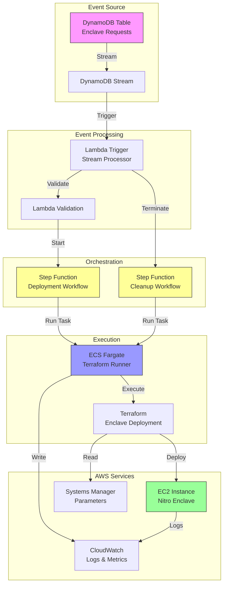
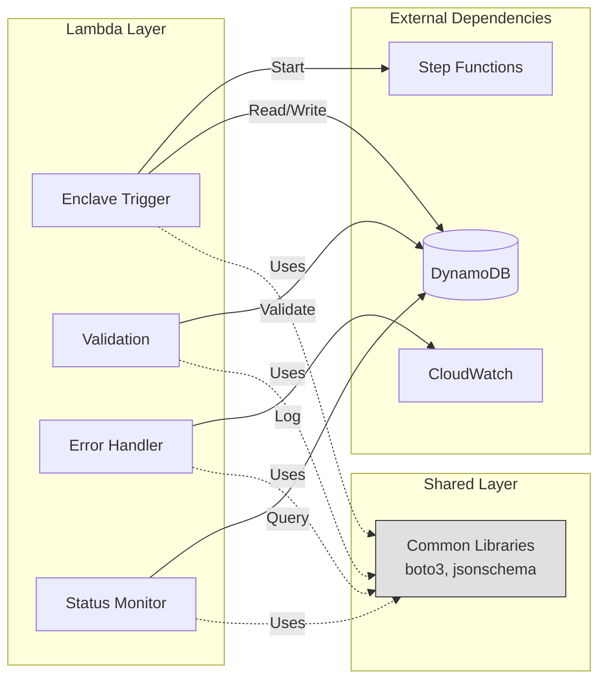
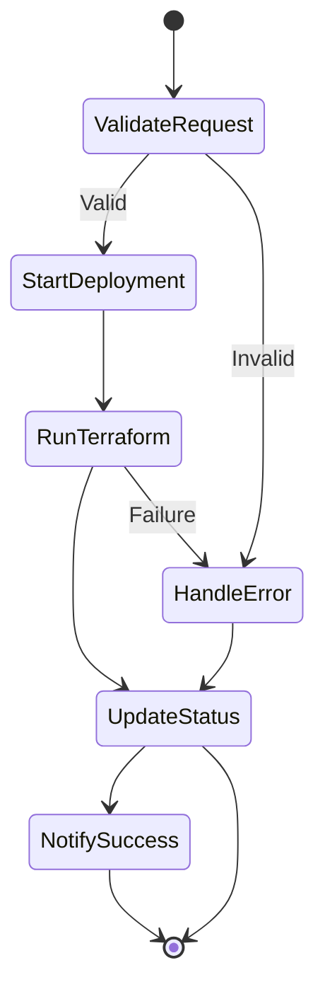
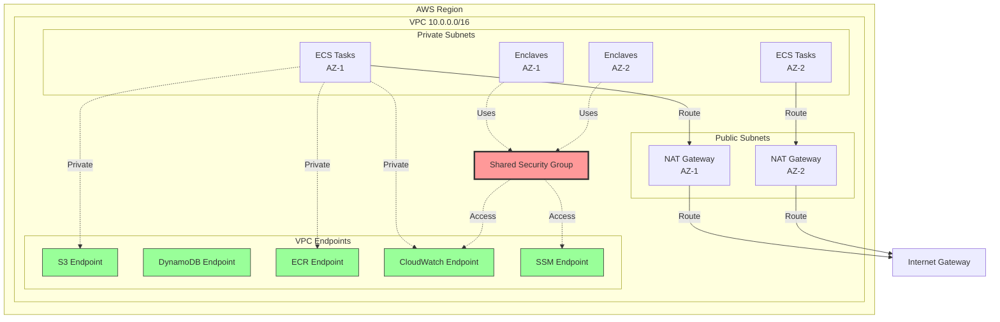
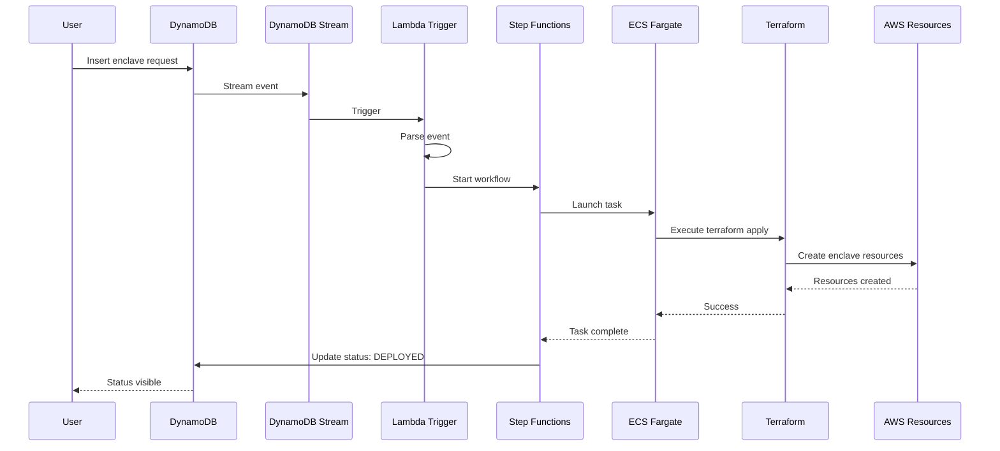
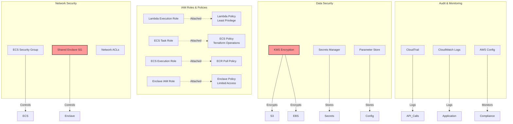
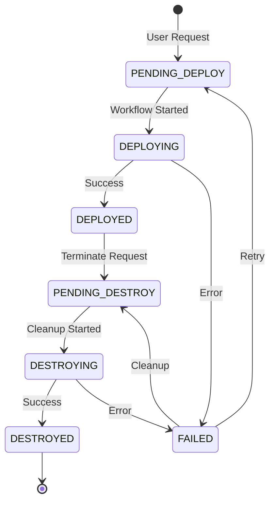
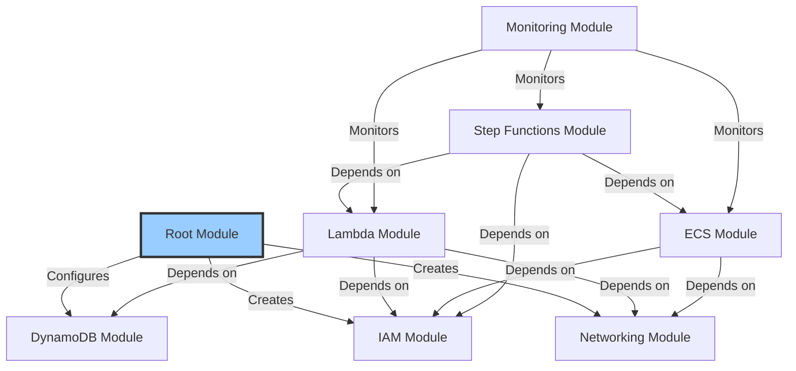
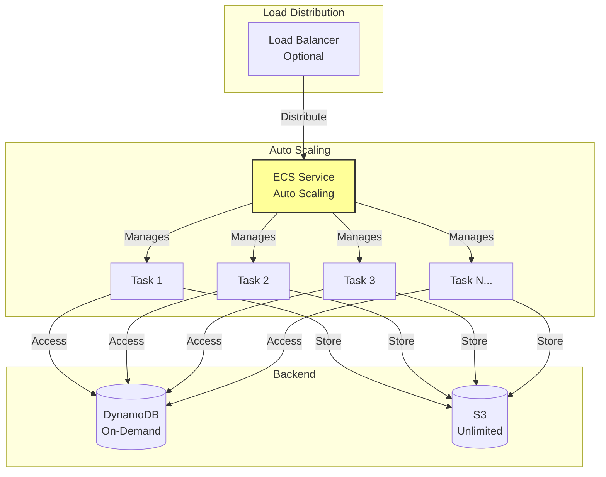
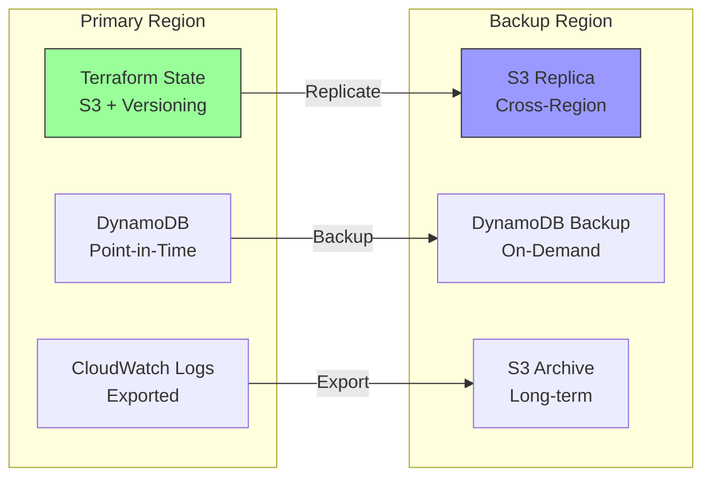

# Architecture Documentation

This document provides detailed architecture diagrams and explanations for the Treza Terraform Infrastructure project.

## 📋 Table of Contents

- [High-Level Architecture](#high-level-architecture)
- [Component Architecture](#component-architecture)
- [Network Architecture](#network-architecture)
- [Deployment Flow](#deployment-flow)
- [Security Architecture](#security-architecture)
- [Data Flow](#data-flow)

## High-Level Architecture



### Key Components

1. **DynamoDB Stream** - Captures changes to enclave request table
2. **Lambda Trigger** - Processes stream events and routes to workflows
3. **Lambda Validation** - Validates enclave configurations
4. **Step Functions** - Orchestrates long-running workflows
5. **ECS Fargate** - Runs Terraform in isolated containers
6. **Terraform** - Deploys and manages enclave infrastructure
7. **EC2 Nitro Enclaves** - Secure compute environments

## Component Architecture

### Lambda Functions



### Step Functions Workflows



## Network Architecture



### Network Flow

1. **ECS Tasks** run in private subnets
2. **NAT Gateways** provide internet access for outbound traffic
3. **VPC Endpoints** enable private access to AWS services
4. **Shared Security Group** grants enclaves access to endpoints
5. **No direct internet** access for enclaves

## Deployment Flow



### Deployment Steps

1. User inserts deployment request in DynamoDB
2. Stream triggers Lambda function
3. Lambda validates and starts Step Function
4. Step Function launches ECS Fargate task
5. ECS task runs Terraform apply
6. Terraform creates enclave infrastructure
7. Status updates flow back to DynamoDB
8. User sees deployment status

## Security Architecture



### Security Layers

1. **Identity & Access Management**
   - Least privilege IAM roles
   - Service-to-service authentication
   - No hardcoded credentials

2. **Network Security**
   - Private subnet deployment
   - Security group isolation
   - VPC endpoints for AWS services
   - No direct internet access

3. **Data Protection**
   - Encryption at rest (KMS)
   - Encryption in transit (TLS)
   - Secrets Manager for credentials
   - Parameter Store for configuration

4. **Audit & Compliance**
   - CloudTrail for API auditing
   - CloudWatch Logs for application logs
   - AWS Config for compliance monitoring
   - VPC Flow Logs for network traffic

## Data Flow

### Deployment Request Flow

```
┌─────────────────────────────────────────────────────────────┐
│                     Deployment Request                       │
└─────────────────────────────────────────────────────────────┘
                              │
                              ▼
                    ┌──────────────────┐
                    │  DynamoDB Table  │
                    │  Status: PENDING │
                    └──────────────────┘
                              │
                              ▼ Stream Event
                    ┌──────────────────┐
                    │  Lambda Trigger  │
                    │  Parse & Route   │
                    └──────────────────┘
                              │
                    ┌─────────┴─────────┐
                    ▼                   ▼
          ┌──────────────────┐  ┌──────────────────┐
          │ Validation       │  │ Start Workflow   │
          │ Check Schema     │  │ Step Functions   │
          └──────────────────┘  └──────────────────┘
                    │                   │
                    └─────────┬─────────┘
                              ▼
                    ┌──────────────────┐
                    │   ECS Fargate    │
                    │ Status: DEPLOYING│
                    └──────────────────┘
                              │
                              ▼
                    ┌──────────────────┐
                    │    Terraform     │
                    │  Apply Changes   │
                    └──────────────────┘
                              │
                              ▼
                    ┌──────────────────┐
                    │ EC2 + Enclave    │
                    │ Status: DEPLOYED │
                    └──────────────────┘
                              │
                              ▼
                    ┌──────────────────┐
                    │  Update Status   │
                    │  in DynamoDB     │
                    └──────────────────┘
```

### Status Lifecycle



## Infrastructure as Code

### Terraform Module Structure

```
terraform/
├── main.tf                 # Root module
├── variables.tf           # Input variables
├── outputs.tf            # Output values
└── modules/
    ├── networking/       # VPC, subnets, endpoints
    ├── iam/             # IAM roles and policies
    ├── lambda/          # Lambda functions
    ├── ecs/             # ECS cluster and tasks
    ├── step-functions/  # Workflow definitions
    ├── monitoring/      # CloudWatch dashboards
    └── dynamodb/        # DynamoDB configuration
```

### Module Dependencies



## Scaling Architecture

### Horizontal Scaling



### Performance Characteristics

| Component | Throughput | Latency | Scalability |
|-----------|-----------|---------|-------------|
| DynamoDB Stream | 1000 records/sec | < 1 second | Auto-scales |
| Lambda Trigger | 1000 concurrent | < 100ms | Auto-scales |
| Step Functions | 4000/sec | Varies | Auto-scales |
| ECS Fargate | 100s of tasks | Varies | Manual/Auto |
| Terraform | Sequential | 5-30 min | Parallel runs |

## Disaster Recovery

### Backup Strategy



## Cost Architecture

### Cost Breakdown by Component

```
Monthly Cost Estimate (Development)

VPC & Networking        │████████████████░░░░░░░░ $35 (70%)
ECS Fargate             │██░░░░░░░░░░░░░░░░░░░░░░  $5 (10%)
Lambda Functions        │█░░░░░░░░░░░░░░░░░░░░░░░  $2 (4%)
CloudWatch              │█░░░░░░░░░░░░░░░░░░░░░░░  $3 (6%)
DynamoDB                │█░░░░░░░░░░░░░░░░░░░░░░░  $2 (4%)
Other Services          │█░░░░░░░░░░░░░░░░░░░░░░░  $3 (6%)
                        └─────────────────────────
                        Total: ~$50/month
```

### Cost Optimization Opportunities

1. **NAT Gateways** - Largest cost driver
   - Use single NAT for dev
   - Consider NAT instances
   - Use VPC endpoints

2. **ECS Fargate** - Usage-based
   - Right-size task resources
   - Spot pricing for non-critical
   - Optimize runtime

3. **CloudWatch Logs** - Storage-based
   - Shorter retention for dev
   - Export to S3
   - Filter before logging

## References

- [AWS Well-Architected Framework](https://aws.amazon.com/architecture/well-architected/)
- [Terraform AWS Provider](https://registry.terraform.io/providers/hashicorp/aws/latest)
- [AWS Nitro Enclaves](https://docs.aws.amazon.com/enclaves/)

---

**Last Updated**: November 2024  
**Version**: 2.0.0

